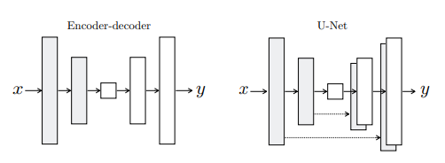

# GAN notes
- We have 2 types of components in image :
    - ####  low-frequency components (global structure) : 
         
this correspond to smooth or slowly varying patterns in the image (ex: in a landscape, the overall terrain) 
    
    - #### high-frequency components (fine details) :
        
the rapidly varying patterns in image,(ex: face edge or fin lines arround the eyes)
    
## Pix2pix notes
### Introduction :
The goal is to tell CNN what wish it to minimize (carefully choosing a loss function).

 
#### Example
if we choose to minimize the euclidean distance between the pixels of original image (ground truth) and the generated images it will tend to produce blurry results, because L2 loss tend to minimize the average diffrence between pixels which will [high-frequency components](#high-frequency-components-fine-details).

**The Objective** is to specify a high frequency goal to get a realistic image with fine details.

### Method :

Training a conditional GAN to map edges→photo. The
discriminator, D, learns to classify between fake (synthesized by
the generator) and real {edge, photo} tuples. The generator, G,
learns to fool the discriminator. **Unlike** a traditional GAN,
both the generator and discriminator observe the input edge map.

### Objective :

$$\mathcal{L}_{\text{cGAN}}(G, D) = \mathbb{E}{y}\left[\log D(y)\right] + \mathbb{E}{x,z}\left[\log\left(1 - D\left(G\left(x, z\right)\right)\right)\right] $$

1. The objectif function of cGAN

The first term encourages the discriminator to correctly classify real samples as real (outputting 1), and the second term encourages the discriminator to correctly classify generated samples as fake (outputting 0).

To clearly understand the diffrence between **GAN** and **cGAN** :

$$\mathcal{L}_{\text{GAN}}\left(G, D\right) = \mathbb{E}{y}\left[\log D\left(y\right)\right] + \mathbb{E}{x,z}\left[\log\left(1 - D\left(G\left(x, z\right)\right)\right)\right]$$

2. The objectif function of GAN* 

**Note :**
Without $z$, the net could still learn a mapping from $x$ to $y$, but would produce **deterministic** outputs and therefore fail to match any distribution other than a delta function (missing diversity and realism).

In initial expirement, they use a **Gaussian noise**, but the generator learned to **ignore** it.

Instead for there final model, they yse noise in the forme of dropout layers.

### Generator with skips :
The generator network requires that all information flow pass through all the layers, including the bottleneck (The middle and the smallest layer of the network). For many image translation problems, there is a great deal of low-level information shared between the input and output, and it would be desirable to shuttle this information directly across the net. For example, in the case of image colorization, the input and output share the location of prominent edges. This is goal of the skips in the U-Net architecture.

3. Two choices for the architecture of the generator* 

### Markovian discriminator (PatchGAN) :
We already know the fact that L1 and L2 losses can effictively capture [low frequency compononet](#low-frequency-components-global-structure), this motivates restricting GAN descriminator to only model [high-frequency components](#high-frequency-components-fine-details). Therefore, we design a PatchGAN discriminator architecture.

**Note :**
In a PatchGAN discriminator, instead of producing a single output for the entire input image, the network classifies each patch or local region of the image independently. This approach helps capture more fine-grained details and enables the discriminator to provide feedback on the realism of local image structures. The generator, in turn, can focus on generating realistic details at the patch level.